# Customer Revenue & Delivery Intelligence Dashboard

**One-line hook:** An end-to-end ecommerce analytics project showing how delivery delays, revenue patterns, product categories, and seller behavior affect customer satisfaction.

---

## Project Overview

This project analyzes the Olist Brazilian Ecommerce dataset to understand how revenue, delivery performance, product categories, seller behavior, and customer reviews connect to overall marketplace performance.

The project includes:

- SQL data cleaning and analysis
- Python exploratory data analysis
- Power BI dashboard development
- Machine learning model testing
- Final business insights and recommendations

The main business question is:

**How do delivery performance, revenue, product categories, and seller behavior affect customer satisfaction?**

---

## Final Results Summary

| Area | Final Result |
|---|---|
| Total Orders | 99,441 |
| Paid Orders | 99,440 |
| Delivered Orders | 96,478 |
| Canceled Orders | 625 |
| Total Payment Value | 16,008,872.12 |
| Average Order Value | 160.99 |
| Average Review Score | 4.09 |
| Late Order Rate | 8.11% |
| Best Machine Learning Model | Random Forest with Tuned Threshold |
| Best F1 Score | 0.5457 |

---

## Key Business Insight

The strongest insight from this project is:

**Delivery performance is one of the biggest drivers of customer review outcomes.**

Orders delivered late had noticeably lower review scores. Orders delivered more than 7 days late had the weakest review performance, while early or on-time deliveries had much stronger customer satisfaction.

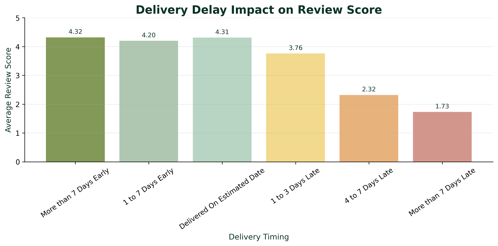

---

## Dataset

This project uses the Olist Brazilian Ecommerce dataset, which contains order, customer, seller, product, payment, delivery, and review information.

The cleaned master dataset used in this project contains:

- 99,441 total orders
- 30 final master columns
- Delivery performance fields
- Payment and revenue fields
- Review score groupings
- Product and seller summary fields

---

## Tools Used

- SQL
- SQLite
- Python
- Pandas
- Matplotlib
- Scikit-learn
- XGBoost
- LightGBM
- Imbalanced-learn
- Power BI
- Jupyter Notebook
- VS Code

---

## Project Workflow

### 1. SQL Cleaning and Analysis

SQL was used to clean and combine the ecommerce data into a final master analysis table.

Important cleaning decisions:

- Review rows were grouped by `order_id`.
- Payment rows were summed by `order_id`.
- Product categories were cleaned and translated.
- Order item rows were summarized by order.
- Missing values were not blindly dropped because many missing values had business meaning.

The main SQL view created was:

```text
analysis_orders_master

```

This view became the foundation for Power BI, Python EDA, and machine learning.

---

### 2. Power BI Dashboard

A Power BI dashboard was created to summarize executive-level business performance.

The dashboard includes:

- Total Orders
- Total Payment Value
- Delivered Orders
- Average Review Score
- Average Order Value
- Late Delivery Rate
- Monthly Payment Value Trend
- Top Product Categories by Revenue
- Delivery Delay Impact on Review Score
- Late Delivery Rate by State

---

### 3. Python Exploratory Data Analysis

Python was used to create visual insights and confirm the business findings from SQL.

#### Order Status Distribution

Most orders were successfully delivered.

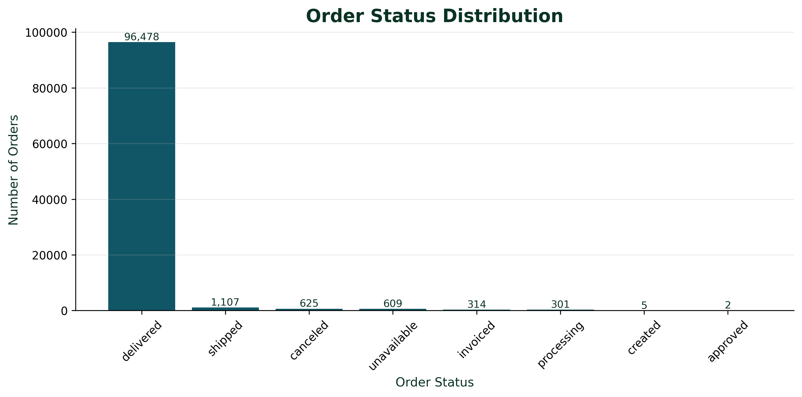

#### Review Group Distribution

Most orders received high reviews, but low reviews were important for identifying delivery and seller risk.

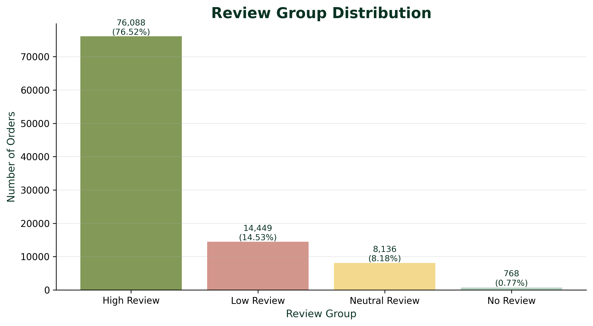

#### Monthly Payment Value Trend

Revenue increased strongly from late 2016 into 2018.

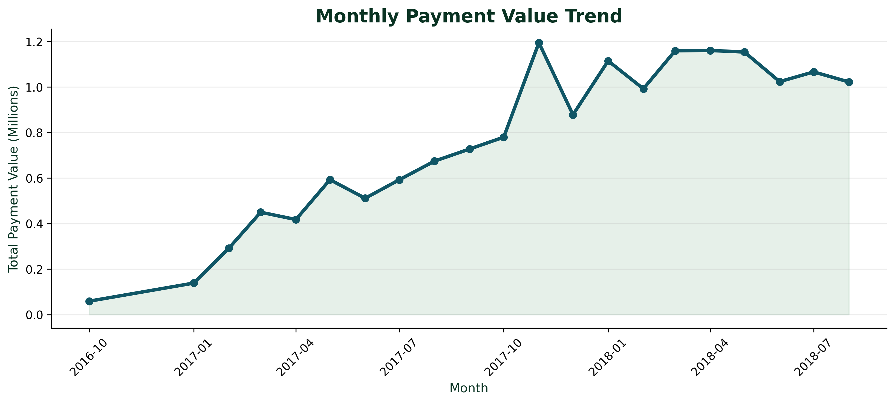

#### Top Product Categories by Revenue

The highest revenue categories included `health_beauty`, `watches_gifts`, `bed_bath_table`, `sports_leisure`, and `computers_accessories`.

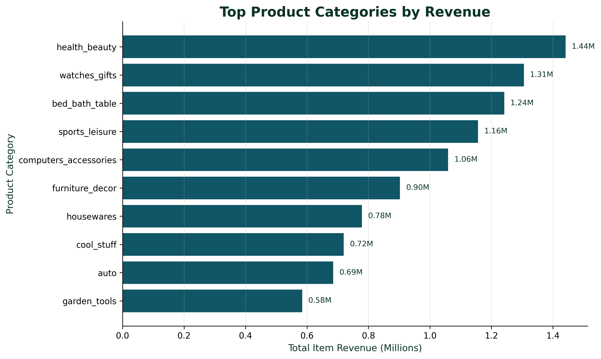

#### Delivery Delay Impact on Review Score

Review scores dropped as delivery delays increased.


#### Late Delivery Rate by State

Some states had much higher late delivery rates than others.

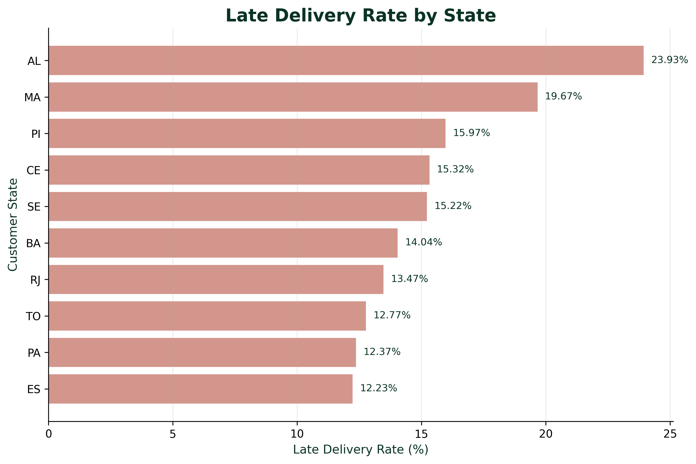

#### Revenue vs Review Score by Product Category

Some categories had strong revenue but weaker review performance, showing possible customer satisfaction risk.

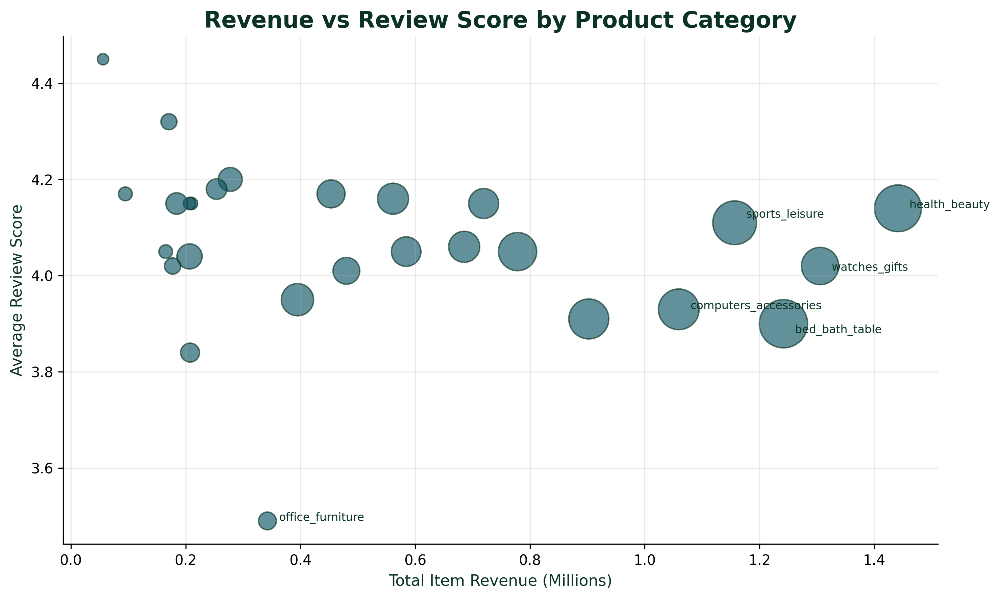

#### Seller Risk

Seller risk was analyzed using revenue, delivery performance, and average review score.

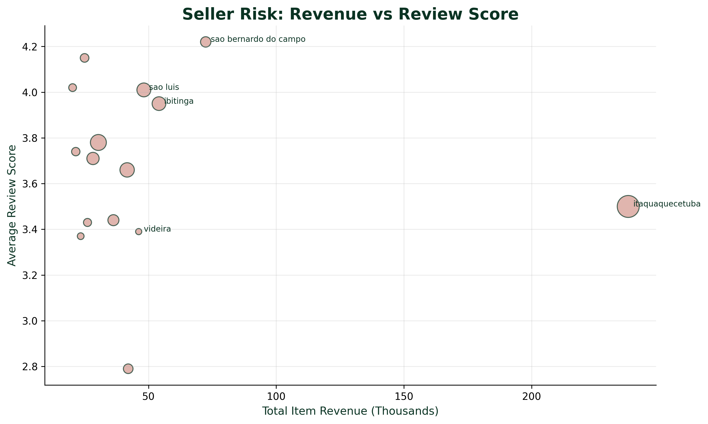

---

## Machine Learning Modeling

A machine learning model was created to predict whether an order would receive a low review.

The target variable was:

```text
Low Review = 1
Not Low Review = 0
```

Orders with `No Review` were removed because they did not contain an actual customer rating.

Review-related columns were removed from the feature set to avoid data leakage:

```text
avg_review_score
review_count
review_group
```

---

## Models Tested

Several models and experiments were tested:

- Logistic Regression
- Random Forest
- HistGradientBoosting
- XGBoost
- Balanced Random Forest
- LightGBM
- Random Forest with KNN-style imputation
- Random Forest with KMeans cluster feature
- Random Forest with tuned threshold

The best final model was:

```text
Random Forest with Tuned Threshold
```

---

## Final Model Results

| Metric | Value |
|---|---:|
| Accuracy | 0.8848 |
| Precision | 0.6456 |
| Recall | 0.4727 |
| F1 Score | 0.5457 |

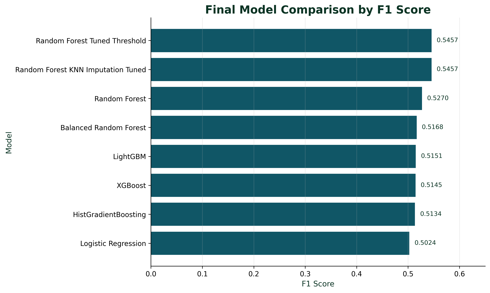

---

## Final Confusion Matrix

The final model confusion matrix showed:

| Result | Count |
|---|---:|
| Correctly predicted Not Low Review | 16,095 |
| Incorrectly flagged as Low Review | 750 |
| Missed Low Review orders | 1,524 |
| Correctly predicted Low Review | 1,366 |

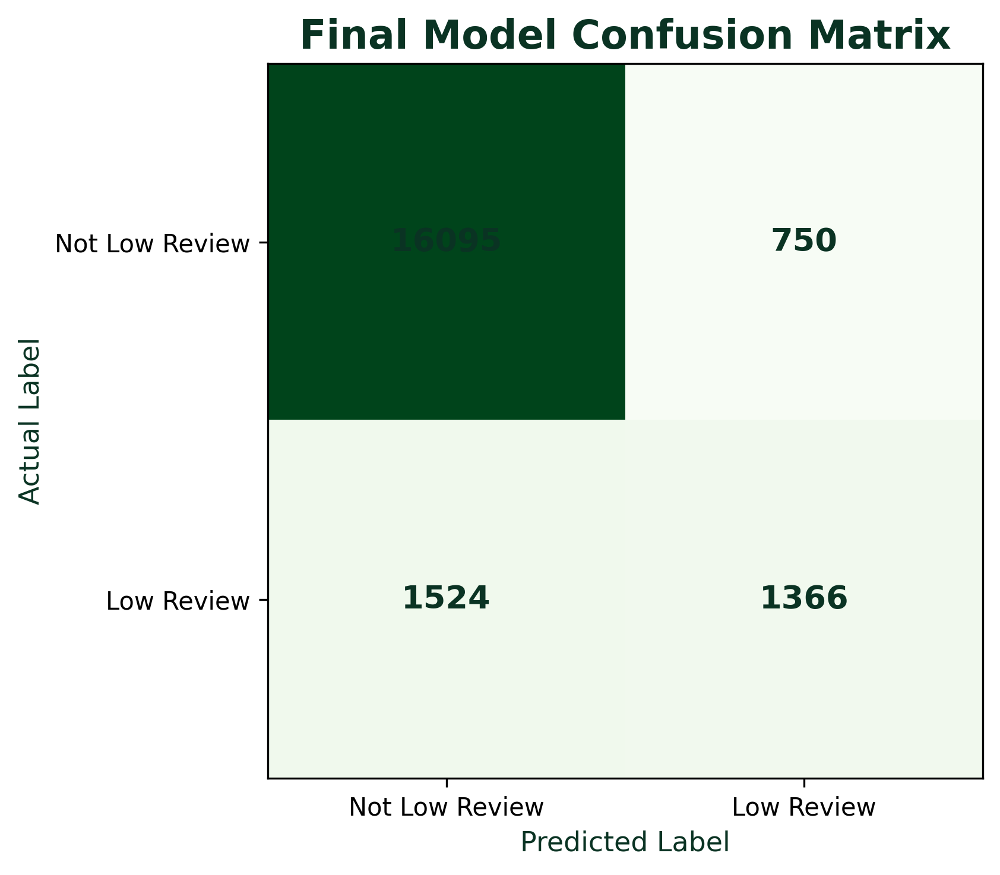

The model is useful for identifying some low-review risk, but it is not perfect. It performs better at identifying orders that are not likely to receive low reviews than it does at catching every low-review order.

---

## Feature Importance

The Random Forest model found that delivery-related features were the strongest predictors of low reviews.

Top important features included:

- `delay_days`
- `order_status_delivered`
- `delivery_days`
- `is_late`
- `item_row_count`

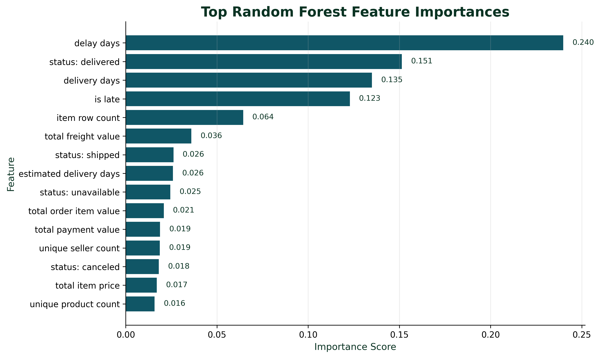

This supports the main business finding that delivery performance is strongly connected to customer satisfaction.

---

## Important Modeling Limitation

The final model should be treated as a **post-delivery risk model**.

This is because the model uses delivery outcome features such as:

- `delay_days`
- `delivery_days`
- `is_late`

These features are only known after delivery information is available.

Because of this, the model is useful for understanding what drives low reviews, but it is not a true pre-shipment prediction model.

A future version could build a true pre-delivery model using only information available before shipment.

---

## Final Business Conclusion

The marketplace performs well overall, with strong order volume, high delivered order counts, and a high average review score.

However, the analysis also shows clear business risks:

- Late deliveries strongly reduce customer satisfaction.
- Some states have higher delivery risk.
- Some product categories generate strong revenue but weaker reviews.
- Some sellers have meaningful revenue but weaker customer satisfaction.
- Machine learning can identify some low-review risk, but the final model is best used as a post-delivery risk tool.

The strongest overall business conclusion is:

**Improving delivery performance is one of the clearest ways to improve customer satisfaction.**

---

## Project Structure

```text
Customer Revenue & Delivery Intelligence Dashboard/
│
├── dashboard/
│
├── data/
│   ├── database/
│   ├── processed_data/
│   │   └── powerbi/
│   └── raw/
│
├── data_screenshots/
│
├── images/
│   ├── category_revenue_vs_review_score.png
│   ├── delivery_delay_impact_review_score.png
│   ├── final_model_comparison_f1_score.png
│   ├── final_model_confusion_matrix.png
│   ├── late_delivery_rate_by_state.png
│   ├── model_comparison_f1_score.png
│   ├── monthly_payment_value_trend.png
│   ├── order_status_distribution.png
│   ├── random_forest_feature_importance.png
│   ├── review_group_distribution.png
│   ├── seller_risk_revenue_vs_review.png
│   └── top_product_categories_revenue.png
│
├── notebooks/
│   ├── data_loading_and_quality.ipynb
│   ├── exploratory_data_analysis.ipynb
│   ├── feature_engineering.ipynb
│   └── model.ipynb
│
├── reports/
│
├── sql/
│   ├── dashboard_kpi_queries.sql
│   ├── data_quality_checks.sql
│   ├── database.sql
│   ├── delivery_analysis.sql
│   ├── revenue_analysis.sql
│   └── seller_product_analysis.sql
│
├── data_dictionary.md
└── README.md
```

---

## How to Run This Project

1. Open the project folder in VS Code.

2. Make sure the database exists in:

```text
data/database/olist_ecommerce.db
```

3. Run the SQL files from the `sql/` folder.

4. Open the notebooks in this order:

```text
notebooks/data_loading_and_quality.ipynb
notebooks/exploratory_data_analysis.ipynb
notebooks/model.ipynb
```

5. Open the Power BI dashboard from the `dashboard/` folder.

---

## Future Improvements

Future versions of this project could include:

- A true pre-shipment prediction model
- Seller-level risk scoring
- Customer segmentation
- Product category risk scoring
- More detailed geographic delivery analysis
- A multi-page Power BI dashboard with seller and product risk pages

---
